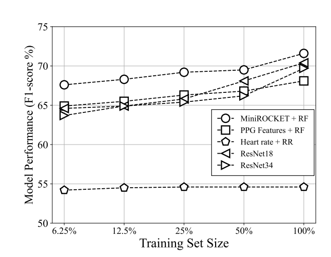

# Hypertension Detection From High-Dimensional Representation of Photoplethysmogram Signals

[Published Paper on IEEE Xplore](https://ieeexplore.ieee.org/abstract/document/10313498)

[arXiv:2308.02425](https://arxiv.org/abs/2308.02425) (preprint)

The paper has been accepted at IEEE-EMBS International Conference on Biomedical and Health Informatics (BHI’23), Oct. 15–18, 2023, Pittsburgh, Pennsylvania, USA.

**Abstract**

Hypertension is commonly referred to as the "silent killer", since it can lead to severe health complications without any visible symptoms. Early detection of hypertension is crucial in preventing significant health issues. Although some studies suggest a relationship between blood pressure and certain vital signals, such as Photoplethysmogram (PPG), reliable generalization of the proposed blood pressure estimation methods is not yet guaranteed. This lack of certainty has resulted in some studies doubting the existence of such relationships, or considering them weak and limited to heart rate and blood pressure. In this paper, a high-dimensional representation technique based on random convolution kernels is proposed for hypertension detection using PPG signals. The results show that this relationship extends beyond heart rate and blood pressure, demonstrating the feasibility of hypertension detection with generalization. Additionally, the utilized transform using convolution kernels, as an end-to-end time-series feature extractor, outperforms the methods proposed in the previous studies and state-of-the-art deep learning models.

Please cite as:

```bibtex
@inproceedings{hasanzadeh2023hypertension,
  title={Hypertension Detection From High-Dimensional Representation of Photoplethysmogram Signals},
  author={Hasanzadeh, Navid and Valaee, Shahrokh and Salehinejad, Hojjat},
  booktitle={2023 IEEE EMBS International Conference on Biomedical and Health Informatics (BHI)},
  pages={1--4},
  year={2023},
  organization={IEEE}
}
```

This repository contains the codes corresponding to study the feasibility of hypertension detection from PPG using [MiniROCKET](https://github.com/angus924/minirocket).

## Requirements
Please install the following Python (3.8) libraries:

- pyampd
- scipy
- numba
- sklearn
- pandas
- numpy
- matplotlib
- seaborn
- h5py
- imblearn

## Usage 
 1- Download the dataset (~32 GB) from
 https://zenodo.org/record/5590603/files/MIMIC-III_ppg_dataset.h5?download=1
 
 2- Convert the downloaded h5 file to tfrecords using the script available on:
 https://github.com/Fabian-Sc85/non-invasive-bp-estimation-using-deep-learning/tree/main#creating-tfrecord-datasets-for-training
 
 3- Follow and run Hypertension_PPG_MiniROCKET.ipynb for the next steps.
 

## Results

### Dataset

In this study, the PPG signals and corresponding BPs derived from the [MIMIC-III dataset](https://zenodo.org/record/5590603) are used. The BP values are categorized into normal and hypertension classes based on ESC/ESH guidelines. This dataset comprises  3750
  subjects for training and  625
  subjects for testing. The training and test datasets are standardized and divided at subject level to avoid any overlap. There are  1,000,000
  PPG signals for training,  250,000
  samples for validation, and  250,000
  samples for testing. Each PPG sample has a duration of  7
  seconds, and the sampling rate is  125
  Hz.
  
### Performance

The results demonstrate the feasibility of hypertension detection from PPG using random convolution kernels on completely unseen subjects, with a weighted average **F1-score of 71.6%** and **sensitivity of 69.1%**. 

Relying solely on the heart-rate feature for hypertension detection leads to a significantly lower sensitivity of 50.3%. Although this sensitivity is slightly better than chance level, it alone is insufficient for detecting hypertension. This indicates that in addition to heart rate, PPG can provide many BP-related informative attributes that can enhance classification performance significantly.

### Impact of the Number of Training Samples

In order to study the effect of training set size on the models' performance, the models were trained using varying percentages of the training samples: 6.25%, 12.5%, 25%, and 50%. The figure below illustrates the performance of different models as the size of the training set increases.

When only 50% of the training data was used, the highest F1-score amongst the models dropped from 71.6% to 69.2%. Similarly, using 25% of the training samples led to a further decrease to 65.0%. In all scenarios, MiniROCKET consistently outperformed all other methods. The trends indicated by this plot suggest that increasing the size of the training dataset, can result in higher classification accuracy.

<p align="center">

</p>

## Citing this work
Please use the following citation:
```bibtex
@inproceedings{hasanzadeh2023hypertension,
  title={Hypertension Detection From High-Dimensional Representation of Photoplethysmogram Signals},
  author={Hasanzadeh, Navid and Valaee, Shahrokh and Salehinejad, Hojjat},
  booktitle={2023 IEEE EMBS International Conference on Biomedical and Health Informatics (BHI)},
  pages={1--4},
  year={2023},
  organization={IEEE}
}
```
